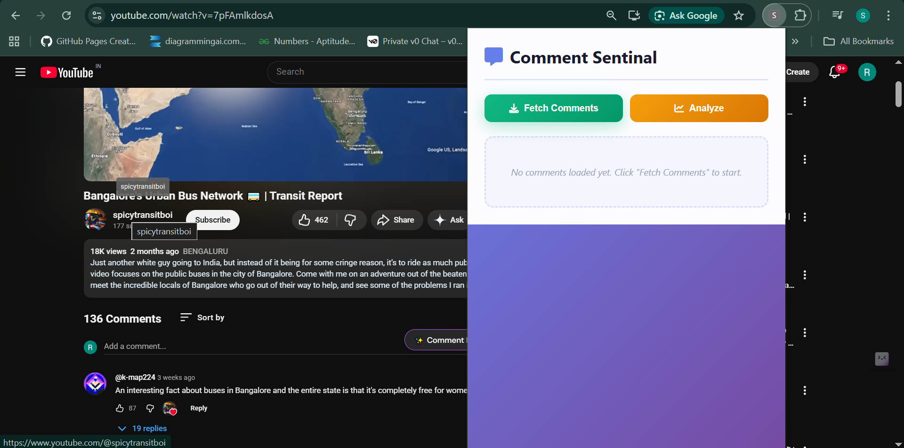
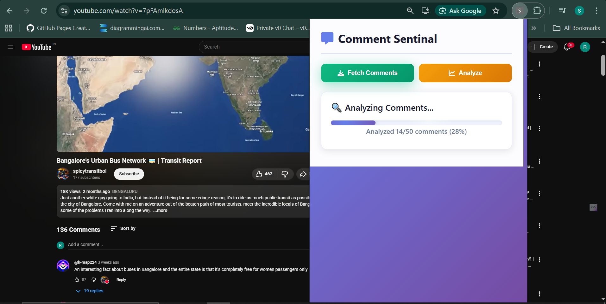
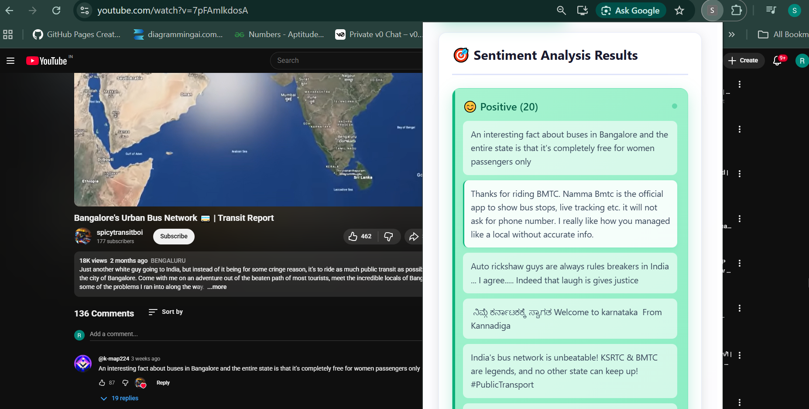
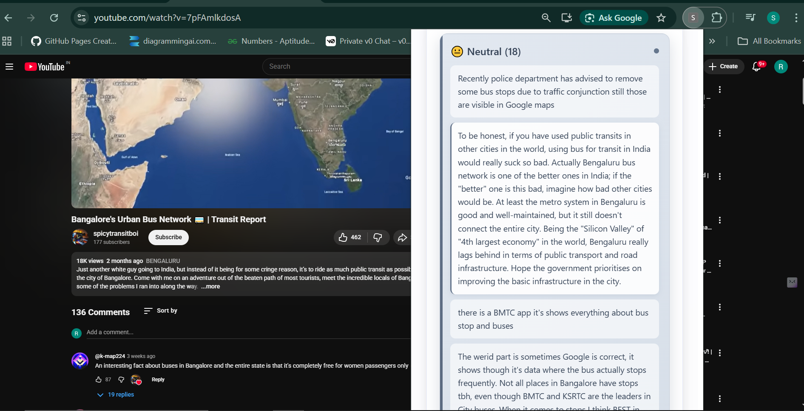
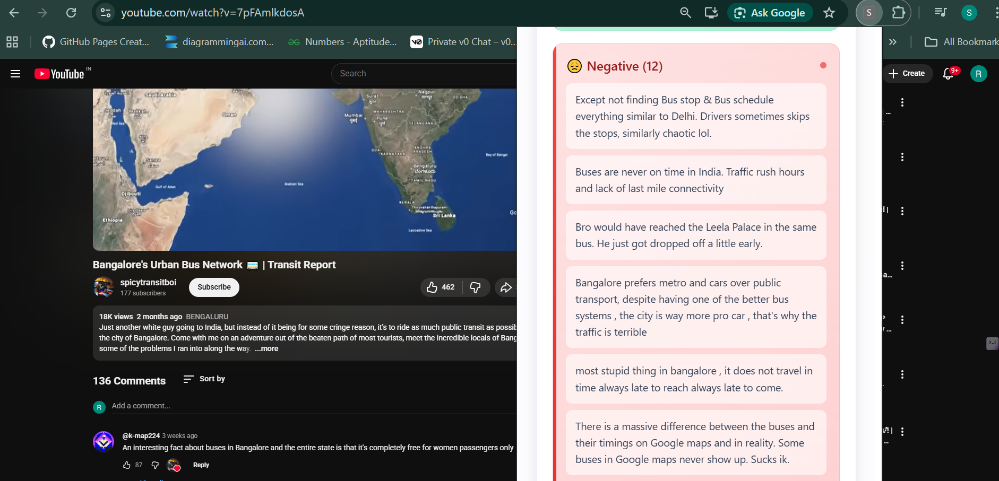

# Sentiment Analyzer Chrome Extension

## Overview
The **Sentiment Analyzer Chrome Extension** is a powerful tool that automatically scrapes, translates, and analyzes comments from popular social media platforms including YouTube, X (Twitter), Instagram, and Facebook. It determines the underlying sentiment (Positive, Neutral, or Negative) of the comments using a robust local Machine Learning model and provides intuitive visual feedback directly in the browser.

## Features
- **Cross-Platform Support**: Works seamlessly on YouTube, Facebook, Instagram, and X (Twitter).
- **Advanced NLP Capabilities**: Leverages the Hugging Face `transformers` library and a PyTorch sequence classification model to accurately grade comments.
- **Multilingual Support**: Uses `langdetect` and `googletrans` to detect non-English comments and translate them on-the-fly before sending them through the sentiment pipeline.
- **Interactive Visualizations**: Displays beautifully formatted analytical charts using `Chart.js` and word clouds, highlighting exactly how users are feeling.
- **Local API Engine**: Runs processing completely locally on a lightweight Flask backend APIs to ensure zero third-party data leaks.

## Tech Stack
### Extension (Frontend)
- **Vanilla Javascript & HTML/CSS**: Core of the Chrome Extension mechanism (`manifest_version 3`).
- **Chrome APIs**: Interacts closely with `tabs`, `scripting`, and page DOM injection (`content.js`).
- **Chart.js & Wordcloud2.js**: Visual library wrappers to provide dynamic UI updates.

### Backend (Inference API)
- **Python & Flask**: Serves a local API loop on `http://localhost:5000/predict`.
- **PyTorch & Transformers**: Performs robust tokenization and neural network-based contextual sentiment analysis.
- **Translation Tools**: Automatic text routing for comprehensive global comment analysis.

## Setup & Installation

### 1. Start the Backend NLP Server
1. Create and activate your virtual Python environment:
   ```bash
   python -m venv venv
   # On Windows:
   venv\Scripts\activate
   # On MacOS/Linux:
   source venv/bin/activate
   ```
2. Install the necessary Python packages:
   ```bash
   pip install -r requirements.txt
   ```
3. Extract the `model.zip` into a `model/` folder in the root directory (so `app.py` can load it).
4. Run the Flask server:
   ```bash
   python app.py
   ```

### 2. Load the Chrome Extension
1. Open Google Chrome and go to exactly `chrome://extensions/`.
2. Toggle on **Developer mode** in the top right corner.
3. Click on **Load unpacked** and select this current project directory (where `manifest.json` lives).
4. Ensure the extension is enabled and optionally pin it to your toolbar. Open a supported social media page and click the extension to start scraping.

## Screenshots 

Below are visual snapshots of the extension's views and charts in action:

### General Application View



### Scraping & Detailed Breakdown


### Sentiment Feedback
**Positive**


**Neutral**


**Negative**

